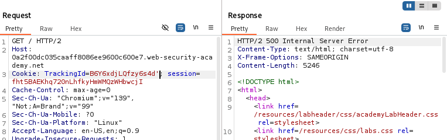

# Lab12: Blind SQL injection — conditional (error-based) responses

Mục tiêu: Khai thác lỗ hổng Blind SQL Injection dựa vào phản hồi lỗi (conditional/error-based) trên cookie TrackingId để rút trích mật khẩu của user administrator và đăng nhập.

Tóm tắt ngắn:

- Ứng dụng dùng cookie TrackingId trong truy vấn SQL. Kết quả truy vấn không được trả về trực tiếp.
- Ứng dụng không thay đổi hiển thị theo số hàng trả về, nhưng nếu truy vấn SQL gây lỗi thì nó trả về một thông báo lỗi tùy chỉnh (HTTP 500).
- Ta lợi dụng việc “xuất hiện lỗi” hay “không lỗi” để suy ra các điều kiện SQL (TRUE/FALSE) và rút trích dữ liệu từng ký tự.

Các bước giải:

-Bước 1 — Bắt request và ghi nhận cookie TrackingId

- Mở trang chính (front page) của ứng dụng trong trình duyệt đã cấu hình proxy Burp.
- Bật Intercept và tải lại trang để bắt request HTTP. Ghi lại giá trị cookie TrackingId (ví dụ: TrackingId=xyz).
- Ảnh minh họa: bắt request / giá trị cookie
- 

-Bước 2 — Gây lỗi cú pháp nguyên thủy để xác nhận injection

- Thêm một dấu nháy đơn vào cuối giá trị cookie:
  - TrackingId=xyz'
- Gửi request và xác nhận rằng bạn nhận được thông báo lỗi (HTTP 500 / custom error). Điều này gợi ý lỗi cú pháp SQL.
- 
- Tiếp theo thử hai dấu nháy đơn:
  - TrackingId=xyz''
- Nếu lỗi biến mất, điều này cho thấy sự khác biệt giữa một dấu nháy đơn unclosed và cặp dấu nháy hợp lệ — dấu hiệu ứng dụng chèn trực tiếp cookie vào chuỗi SQL.
- 

-Bước 3 — Xác định kiểu DB (thử subquery)

- Thử chèn biểu thức con (subquery) hợp lệ về mặt SQL:
  - TrackingId=xyz'||(SELECT '')||'
- 
- Nếu vẫn lỗi, thử khai báo bảng dự phòng:
  - TrackingId=xyz'||(SELECT '' FROM dual)||'
- Nếu lỗi biến mất với FROM dual thì khả năng backend là Oracle (Oracle yêu cầu SELECT phải chỉ rõ bảng, và dual là bảng đặc trưng).
- Ảnh minh họa: thử SELECT '' và SELECT '' FROM dual
- 

-Bước 4 — Chứng minh injection được xử lý như truy vấn SQL (thử table không tồn tại)

- Thử truy vấn một bảng giả:
  - TrackingId=xyz'||(SELECT '' FROM not_a_real_table)||'
- Nếu nhận lỗi, đó là bằng chứng mạnh rằng payload được chạy như SQL ở DB.
- Ảnh minh họa: truy vấn bảng giả gây lỗi
- 

-Bước 5 — Kiểm tra tồn tại bảng users

- Kiểm tra bảng users:
  - TrackingId=xyz'||(SELECT '' FROM users WHERE ROWNUM = 1)||'
- Nếu không có lỗi → bảng users tồn tại.
- Lưu ý: điều kiện WHERE ROWNUM = 1 tránh trả về nhiều hàng làm hỏng phép nối chuỗi.
- Ảnh minh họa: kiểm tra bảng users tồn tại
- 

-Bước 6 — Tạo lỗi có điều kiện (use CASE + divide-by-zero)

- Bạn có thể gây lỗi có điều kiện bằng CASE kết hợp một phép chia cho 0 để ép lỗi:
  - TrackingId=xyz'||(SELECT CASE WHEN (1=1) THEN TO_CHAR(1/0) ELSE '' END FROM dual)||'
- Nếu nhận lỗi khi 1=1 và không lỗi khi 1=2, bạn đã có công cụ boolean-based dựa trên lỗi để suy luận TRUE/FALSE.
- Giải thích: khi điều kiện TRUE, CASE thực thi TO_CHAR(1/0) gây divide-by-zero → lỗi; khi FALSE thì trả rỗng → không lỗi.
- Ảnh minh họa: CASE gây lỗi khi TRUE
- 
- Ảnh minh họa: CASE gây lỗi khi FALSE
- 
  -Bước 7 — Xác nhận user administrator tồn tại
- Kiểm tra admin:
  - TrackingId=xyz'||(SELECT CASE WHEN (1=1) THEN TO_CHAR(1/0) ELSE '' END FROM users WHERE username='administrator')||'
- Nếu nhận lỗi → tồn tại hàng với username='administrator'.
- Ảnh minh họa: kiểm tra admin tồn tại
- 

-Bước 8 — Xác định độ dài mật khẩu administrator

- Dùng CASE cùng LENGTH(password) để kiểm tra độ dài lớn hơn n:
  - TrackingId=xyz'||(SELECT CASE WHEN LENGTH(password)>1 THEN TO_CHAR(1/0) ELSE '' END FROM users WHERE username='administrator')||'
- Lặp tăng n: >1, >2, >3 ... cho đến khi điều kiện không còn gây lỗi nữa — khi đó bạn biết độ dài chính xác. (Trong lab này độ dài là 20 ký tự.)
- Thực hiện các requests này bằng Burp Repeater thuận tiện cho thử tay.
- Ảnh minh họa: kiểm tra độ dài mật khẩu với Repeater
- 
- 
- 
- 
  -Bước 9 — Rút trích từng ký tự với Burp Intruder (Cluster bomb, 2 payload positions)
- Vì cần nhiều request để thử từng ký tự ở mọi vị trí, dùng Burp Intruder với 2 payload positions (vị trí và ký tự) và chọn kiểu tấn công "Cluster bomb":
  1. Gửi request hiện tại sang Intruder.
  2. Thay cookie TrackingId thành payload kiểm tra ký tự với SUBSTR và CASE. Ví dụ kiểm tra ký tự vị trí 1:
     - TrackingId=xyz'||(SELECT CASE WHEN SUBSTR(password,1,1)='a' THEN TO_CHAR(1/0) ELSE '' END FROM users WHERE username='administrator')||'
       (Oracle dùng SUBSTR; SUBSTR(password, pos, 1) lấy 1 ký tự)
  3. Đặt hai vị trí payload:
     - Bôi đen số vị trí (1) trong SUBSTR(password,1,1) → nhấn "Add §" ⇒ payload position #1 (vị trí).
     - Bôi đen ký tự so sánh ('a') → nhấn "Add §" ⇒ payload position #2 (ký tự).
     - Ví dụ cookie sau khi đặt marker sẽ trông như:
       - TrackingId=xyz'||(SELECT CASE WHEN SUBSTR(password,§1§,1)='§a§' THEN TO_CHAR(1/0) ELSE '' END FROM users WHERE username='administrator')||'
  4. Chọn kiểu tấn công: Cluster bomb (kết hợp mọi giá trị payload1 × payload2).
  5. Cấu hình Payload 1 (vị trí):
     - Payload position = 1
     - Payload type = Numbers (Sequential)
     - From = 1, To = 20 (độ dài mật khẩu), Step = 1
     - (Số request = số vị trí × số ký tự)
-  6. Cấu hình Payload 2 (ký tự):
  - Payload position = 2
  - Payload type = Simple list
  - Thêm danh sách ký tự khả dĩ (ví dụ a → z, 0 → 9)
-  7. Tính toán request: ví dụ 20 vị trí × 36 ký tự = 720 requests (kiểm tra Request count ở panel). 8. Start attack. 9. Khi attack chạy xong (hoặc dần dần trong lúc chạy), chuyển sang tab Results.

- Phân tích kết quả:
  - Ở lab này, khi CASE thực thi TO_CHAR(1/0) server trả HTTP 500 (error). Khi không thực thi, server trả HTTP 200.
  - Trong bảng kết quả Intruder, xem cột "Status" — tìm các hàng có Status = 500. Mỗi hàng cho biết một pair (Payload1 = vị trí, Payload2 = ký tự) khiến lỗi xảy ra ⇒ ký tự đúng tại vị trí đó.
  - Ảnh minh họa: các dòng chứa Status 500 (Payload1 = vị trí, Payload2 = ký tự đúng)
- 

- Mẹo khi dùng Cluster bomb:
  - Nếu target giới hạn tốc độ, giảm tốc độ (throttling) hoặc chia nhỏ range vị trí.
  - Nếu có nhiều dòng 500 cho cùng một vị trí (hiếm), kiểm tra Length/Response để phân biệt.
  - Lưu ý số lượng requests lớn — xác nhận bạn đang ở môi trường lab.

-Bước 10 — Lặp và hoàn thiện mật khẩu

- Khi đã xác định ký tự đúng cho từng vị trí i (từ 1 đến độ dài đã biết), ghép các ký tự theo thứ tự để tạo mật khẩu đầy đủ.
- Password khi sắp xếp lại là: cwdtn8woc70u9iz63r1i
  -Bước 11 — Đăng nhập bằng administrator
- Mở My account → Login.
- Username: administrator
- Password: (mật khẩu vừa rút trích)
- Nếu đăng nhập thành công → hoàn thành lab.
- 
