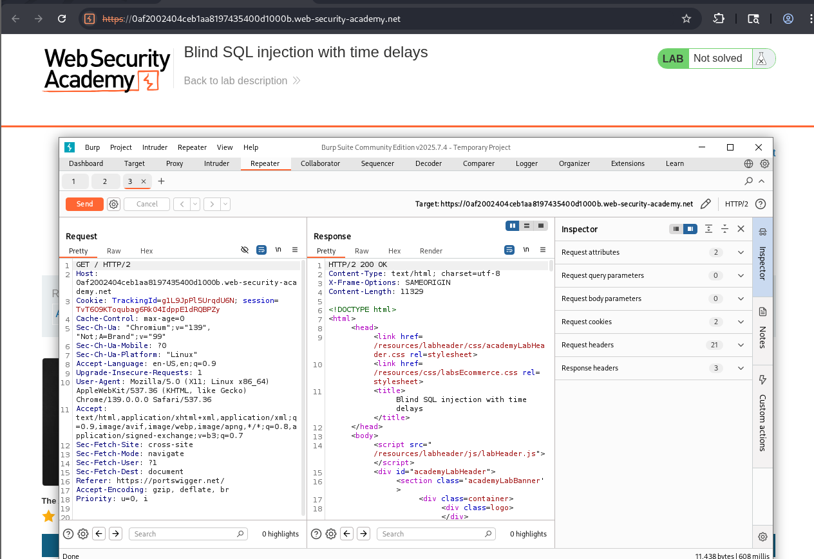
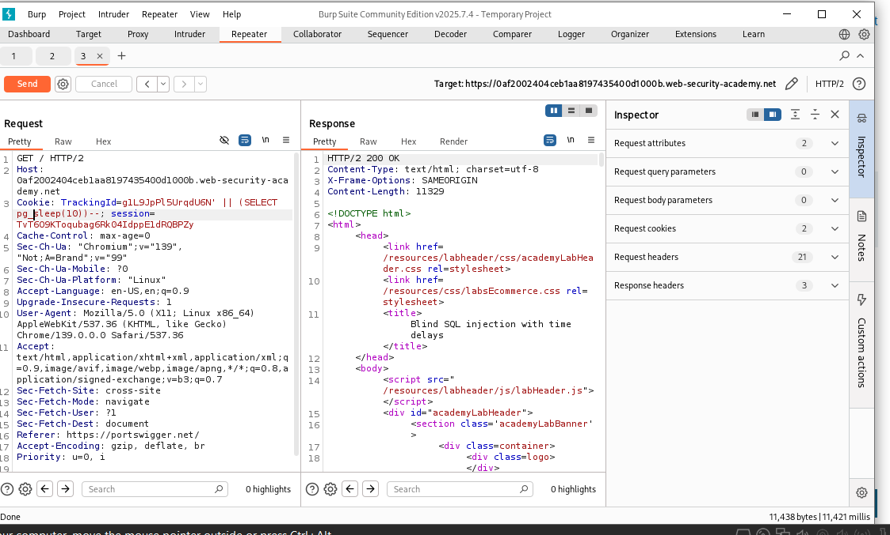
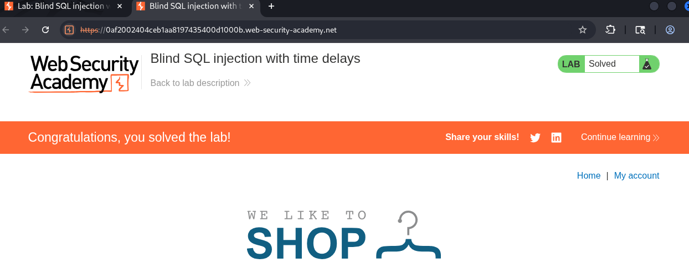

# Lab14: Blind SQL injection — time delays (time-based)

Mục tiêu: Gợi ra độ trễ (10s) thông qua Blind SQL Injection dựa trên time-based payload trên cookie TrackingId để chứng minh kênh rò rỉ bằng thời gian.

Tóm tắt:

- Ứng dụng chèn trực tiếp giá trị cookie TrackingId vào truy vấn SQL.
- Ứng dụng không trả dữ liệu trực tiếp và không khác biệt nội dung khi truy vấn trả về hàng hay không.
- Vì truy vấn chạy đồng bộ, ta có thể buộc DB "sleep" để suy luận TRUE/FALSE dựa trên thời gian phản hồi.

Yêu cầu:

- Burp Suite (Intercept, Repeater).
- Trình duyệt cấu hình proxy (hoặc Burp built-in browser).
- 6 ảnh minh họa để chèn vào báo cáo (đã đặt placeholders bên dưới).

Hướng dẫn chi tiết (có chỗ chèn ảnh — đúng 6 vị trí)

-Bước 1 — Bắt request ban đầu với TrackingId

- Sử dụng Burp Suite (Proxy hoặc Repeater), ta bắt được request gốc gửi đến trang lab.
- Chú ý header Cookie chứa giá trị TrackingId ban đầu. Request này được thực thi rất nhanh, và trang lab hiển thị "Not solved".
- Ảnh minh họa: Request ban đầu trong Burp Repeater.
- 

-Bước 2 — Sửa đổi cookie TrackingId, thay đổi nó thành:

```
  TrackingId=xyz '||(SELECT pg_sleep(10))--
```

- 

-Bước 3 — Gửi request đi và quan sát thấy ứng dụng mất 10 giây để phản hồi,.

- Sau khi gửi thành công payload gây trễ (như ở Bước 2) và máy chủ đã phản hồi chậm ~10 giây, hệ thống ghi nhận đã khai thác thành công lỗ hổng.
- Trang web sẽ cập nhật và hiển thị thông báo "Solved".
- 
